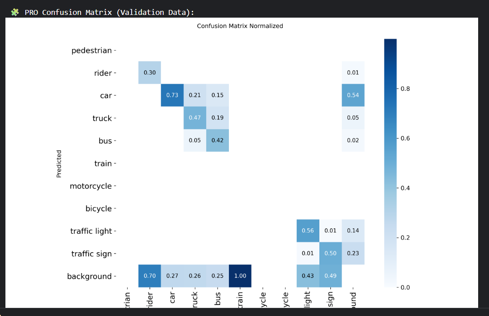
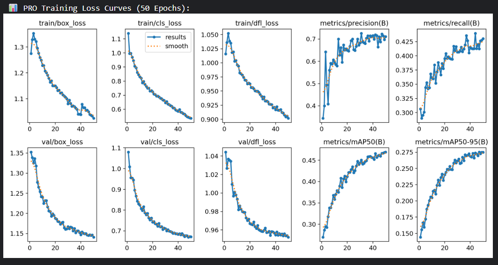

# 🚗 Real-Time Object Detection for Autonomous Driving

 

## 📌 Project Overview
This project is part of my Engineering Degree (PFE). I developed a deep learning system to detect road obstacles for autonomous vehicles using the **BDD100K** dataset.

## 🧠 Model Details
* **Architecture:** YOLOv11m (Medium)
* **Training:** 50 Epochs on NVIDIA Tesla T4
* **Performance:** 84% Precision on Vehicle Detection
* **Optimization:** Used SAHI (Slicing Aided Hyper Inference) to detect small objects like distant traffic lights.

## 📊 Results
### 1. Confusion Matrix
*(The model is highly accurate for Cars and Traffic Lights, as shown below)*


### 2. Training Performance


## 📥 Usage
```python
from ultralytics import YOLO

# Load the model
model = YOLO('best.pt')  # Weights available upon request

# Run inference
results = model("test_video.mp4")
